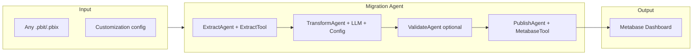

# Generic Power BI to Metabase Migration Utility (Agent-Based)

## Goal

Build a **reusable utility** that can transform **any** Power BI project (.pbit or .pbix) into Metabase dashboards, with **customization** (naming, chart preferences, DB dialect, which pages to migrate, etc.), implemented as a **Java AI agent** using **LangChain4j** or **Spring AI**.

---

## What the Utility Consumes

- **Input**: Any .pbit (or .pbix) file path + a **customization config** (YAML/JSON).
- **Power BI file contents** (inside the file as ZIP):
  - **DataModelSchema** — JSON (UTF-16 LE): tables, columns, calculated columns, **measures** (DAX), relationships, hierarchies.
  - **Report/Layout** — JSON (UTF-16 LE): report pages, visuals, filters.
  - **DataMashup** — binary (Power Query M); source details not easily readable.
  - Custom visuals and static resources (maps, images).
- **Data**: Target data must live in a **database that Metabase connects to** (e.g. Postgres, MySQL). The utility does not ingest data; it generates Metabase questions/dashboards that query that DB.

---

## Customization Config (Schema)

The utility should accept a config that drives agent and tool behavior. Example shape:

- `**targetDialect`**: `postgres` | `mysql` | `bigquery` — SQL dialect for generated queries.
- `**metabase`**: `baseUrl`, `databaseId`, credentials (or env vars).
- `**naming`**: `dashboardNamePrefix`, `cardNamePrefix` — optional prefixes for created assets.
- `**chartOverrides`**: Map Power BI visual type → Metabase display type (e.g. `choropleth` → `bar`).
- `**pagesToInclude`**: List of report page names to migrate, or `"*"` for all.
- `**defaultDisplay`**: Default Metabase chart type when no mapping exists (e.g. `table` or `line`).

This config is passed into the agent scope so the LLM and tools can apply it during transform and publish.

---

## High-Level Agent Architecture

---

## Recommended Approach (Without Requiring LangChain/LangGraph)

**Best path**: Use **Python for extraction** (reuse existing tools), then **one AI step** (single LLM call) to produce SQL + Metabase card configs, then **Python or Java** to drive the **Metabase API**. No LangChain/LangGraph needed unless you want to learn them.

### 1. Data pipeline (prerequisite)

- Get COVID-19 data into a DB Metabase can use (e.g. Postgres).
- Options: Replicate USAFacts ingestion (CSV/API) with a small ETL job, or use any DB where you can create tables that match the Power BI model (e.g. `COVID`, date dimension). Your [user-postgres MCP](file:///Users/anupamg/.cursor/projects/Users-anupamg-Desktop-Code-Credila-BI/mcps/user-postgres) can be used to inspect or create schema once you have a target DB.

### 2. Extract (Python preferred)

- **Unzip** the .pbit and read **DataModelSchema** and **Report/Layout** as **UTF-16 LE** (both are UTF-16 encoded), then parse as JSON.
- Use existing Python libraries to avoid reinventing:
  - **[PyPbitExtractor](https://pypi.org/project/PyPbitExtractor/)** — extracts DataModelSchema to JSON, plus measures, relationships, and can output to JSON/Excel.
  - **[PyDaxExtract](https://pydaxextract.readthedocs.io/)** — extracts DAX expressions, Power Query references, and relationships from the schema.
- **Output**: A single intermediate artifact, e.g. `extracted.json`, containing:
  - Table list and columns (and which are calculated).
  - All **measures** with DAX expressions.
  - **Relationships** (from/to tables/columns).
  - From Layout: **list of visuals** per page (type, filters, and which fields/measures they use, if available in Layout).

If you prefer **Java only**: Implement unzip (e.g. `java.util.zip`), read entries with `Charset.forName("UTF-16LE")`, parse JSON (Gson/Jackson), and walk `model.tables`, `model.relationships`, and measure definitions yourself. No Python dependency, but more code.

### 3. Transform: DAX + visuals → SQL + Metabase cards (AI-assisted)

- **Input**: The `extracted.json` (schema, measures, relationships, list of visuals).
- **One structured LLM call** (e.g. OpenAI/Claude API from Python or Java):
  - Prompt: “Given this Power BI schema and these DAX measures and list of visuals, output a JSON array of Metabase card definitions: for each card give `name`, `description`, `dataset_query` (native SQL), `display` (e.g. `table`, `line`, `bar`, `map`), and `visualization_settings` where applicable.”
  - Optionally include Metabase API docs or examples in the prompt so the model outputs the exact shape expected by the API.
- **Why AI**: DAX → SQL is non-trivial (CALCULATE, filter context, relationships); an LLM can map simple measures to `GROUP BY`/aggregations and suggest chart types from visual names/types. You can later replace or assist this step with hand-written SQL if you prefer.
- **LangChain/LangGraph**: Not required. Use a single “prompt + response” call. If you want to **learn LangGraph**, you can later refactor this into a graph (e.g. nodes: extract → convert → validate_sql → publish), but it’s not the “best” way for a one-off migration—only for learning or more complex pipelines.

### 4. Load: Create Metabase dashboard via API

- **Auth**: `POST /api/session` with username/password → use `X-Metabase-Session` header.
- **Create cards**: `POST /api/card` with body containing `name`, `dataset_query` (e.g. `type: "query"`, `query.native.query` = your SQL), `display`, `visualization_settings`.
- **Create dashboard**: `POST /api/dashboard` (name, etc.).
- **Attach cards**: `PUT /api/dashboard/:id/cards` with `ordered_cards` (card id, position/size).
- Implement in **Python** (requests) or **Java** (HttpClient + JSON). Your workspace has no existing Metabase client; add a small script or module that reads the AI-generated JSON and calls these endpoints.

### 5. Custom visuals and maps

- The report uses **custom visuals** (e.g. choropleth, state map). Metabase has different chart types; there is no 1:1 choropleth. Options:
  - Map to the closest Metabase type (e.g. **map** with a region layer if your Metabase version supports it, or **bar/line** by state).
  - Or keep a note “choropleth → bar chart by state” in the generated card config and refine manually in the UI.

---

## LangChain4j vs Spring AI

- **LangChain4j**: Built-in agentic module (`@Agent`, workflows, `@Tool`). Best fit for a **sequential workflow** of agents (Extract → Transform → Publish) with tools (`ExtractPbitTool`, `MetabaseApiTool`). Config passed as `AgenticScope` input.
- **Spring AI**: `ChatClient` + function calling; you orchestrate the pipeline in code. Good if you are all-in on Spring Boot.
- **Recommendation**: Prefer **LangChain4j** for a generic transformer agent; use **Spring AI** if you want to avoid adding LangChain4j and implement the pipeline explicitly.
- **Legacy / Java role**: Java can run the full flow: call a Python script for extraction (or do extraction in Java), call your LLM API, then call Metabase REST API.
- **Metabase client**: Implementing the Metabase API calls in Java is straightforward (session, create card, create dashboard, update cards).
- **LLM**: Use any HTTP client in Java to call OpenAI/Claude API with the same structured prompt you’d use in Python.

---

## Agent Design (LangChain4j): Tools and Workflow

### Tools

- `**ExtractPbitTool`** (`@Tool`): Input: .pbit/.pbix path. Unzips, reads DataModelSchema and Report/Layout as UTF-16 LE, parses JSON; returns normalized extracted schema (tables, columns, measures/DAX, relationships, visuals per page). Implement in Java (e.g. `java.util.zip`, Jackson UTF-16LE).
- **TransformAgent** (LLM): Input from scope: extracted schema + config. Structured prompt to JSON array of Metabase card definitions (name, description, native SQL, display, visualization_settings). Prompt includes config (dialect, chart overrides, naming).
- `**ValidateSqlTool`** (optional): Input: card definitions; optional dry-run/syntax check against target DB.
- `**MetabaseApiTool`** (`@Tool`): Metabase REST (session, create card, create dashboard, add cards). Uses config for baseUrl, databaseId, credentials.

### Sequential workflow

- **ExtractAgent** to output key `extractedSchema`; **TransformAgent** to `metabaseCards`; **ValidateAgent** (optional); **PublishAgent** to `dashboardId`/`dashboardUrl`. Wire with `AgenticServices.sequenceBuilder()`. Initial input: `pbitPath`, `config`. Customization (dialect, chart overrides, naming, pages, Metabase settings) is applied by the LLM and tools. Alternative: **SupervisorAgent** for adaptive ordering.
- **Spring AI alternative**: Same pipeline (Extract, Transform, Publish) implemented in Java with `ChatClient` and explicit code; config as DTO/bean, output parsers (e.g. parse LLM JSON into card objects), and a single runtime (e.g. Python). Not required for “best” migration.

---

## Implementation Order (Generic Utility)

1. **Config model**: Define config DTO/schema (YAML or JSON); load from file or API.
2. **Extract in Java**: .pbit unzip + UTF-16 LE + JSON parse to extracted schema (tables, measures, relationships, visuals). Optional CLI that writes `extracted.json`.
3. **LangChain4j**: Add `langchain4j` + `langchain4j-agentic` + LLM provider; implement `ExtractPbitTool`, `MetabaseApiTool` as `@Tool` classes.
4. **ExtractAgent** calls `ExtractPbitTool`; writes `extractedSchema` to scope.
5. **TransformAgent** reads scope + config; LLM prompt; parse response to Metabase card list; write `metabaseCards` to scope.
6. **PublishAgent** + **MetabaseApiTool**: create session, cards, dashboard, attach cards; write dashboard ID/URL to scope.
7. **Pipeline**: `AgenticServices.sequenceBuilder()` with Extract → Transform → Publish; entry input: `pbitPath`, `config`.
8. **Optional**: ValidateAgent + `ValidateSqlTool`; conditional retry; or Supervisor variant.
9. **CLI or REST**: Expose as e.g. `migrate --pbit path --config config.yaml` for any .pbit and config.

---

## Summary

- **Goal**: Generic Power BI → Metabase transformer with **customization**, implemented as a **Java AI agent** (LangChain4j or Spring AI).
- **Recommendation**: **LangChain4j** (`langchain4j-agentic`) for declarative agents + tools + sequential workflow; **Spring AI** if you prefer Spring-only and explicit Java pipeline.
- **Design**: Extract → Transform (LLM + config) → [Validate] → Publish, with tools for .pbit extraction and Metabase API. Config drives dialect, naming, chart overrides, pages, Metabase connection.
- **Data**: Utility only generates Metabase questions/dashboards; target DB must already contain the data.

