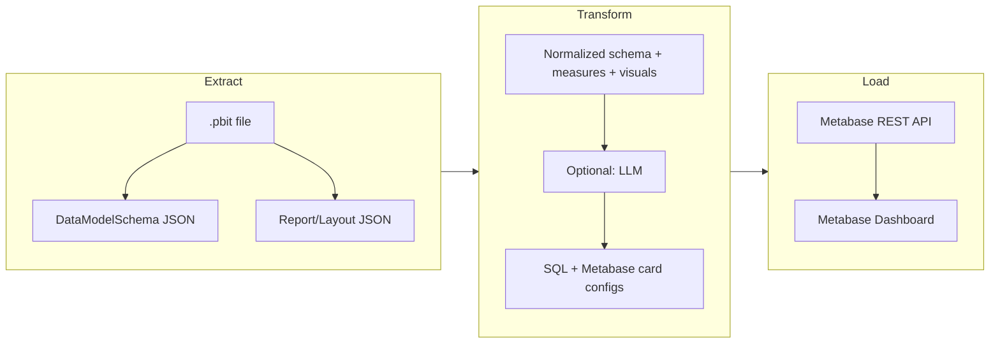

# Power BI to Metabase Migration Plan — v1 (One-Off)

## What You Have

- **File**: COVID-19 US Tracking Sample.pbit — a Power BI *template* (no embedded data; users connect at open).
- **Contents** (inside the .pbit as a ZIP):
  - **DataModelSchema** — JSON (UTF-16 LE) with tables (e.g. `COVID`, date template), columns, calculated columns, **measures** (DAX), relationships, hierarchies.
  - **Report/Layout** — JSON (UTF-16 LE) with report pages, visuals, filters, and visual configs.
  - **DataMashup** — binary (Power Query M compiled); source URLs/connection info are not easily readable without special tools.
  - **Custom visuals** — e.g. choropleth, and static resources (images, USA states topo JSON).
- **Data source**: The sample is designed to use **USAFacts** COVID-19 data. You will need the same (or equivalent) data in a **database that Metabase can connect to** (e.g. Postgres, MySQL).

---

## High-Level Migration Flow

---

## Recommended Approach (Without Requiring LangChain/LangGraph)

**Best path**: Use **Python for extraction** (reuse existing tools), then **one AI step** (single LLM call) to produce SQL + Metabase card configs, then **Python or Java** to drive the **Metabase API**. No LangChain/LangGraph needed unless you want to learn them.

### 1. Data pipeline (prerequisite)

- Get COVID-19 data into a DB Metabase can use (e.g. Postgres).
- Options: Replicate USAFacts ingestion (CSV/API) with a small ETL job, or use any DB where you can create tables that match the Power BI model (e.g. `COVID`, date dimension).

### 2. Extract (Python preferred)

- **Unzip** the .pbit and read **DataModelSchema** and **Report/Layout** as **UTF-16 LE** (both are UTF-16 encoded), then parse as JSON.
- Use existing Python libraries:
  - **PyPbitExtractor** — extracts DataModelSchema to JSON, plus measures, relationships, and can output to JSON/Excel.
  - **PyDaxExtract** — extracts DAX expressions, Power Query references, and relationships from the schema.
- **Output**: A single intermediate artifact, e.g. `extracted.json`, containing: table list and columns, all measures with DAX, relationships, and from Layout the list of visuals per page.

If you prefer **Java only**: Implement unzip (e.g. `java.util.zip`), read entries with `Charset.forName("UTF-16LE")`, parse JSON (Gson/Jackson), and walk `model.tables`, `model.relationships`, and measure definitions yourself.

### 3. Transform: DAX + visuals → SQL + Metabase cards (AI-assisted)

- **Input**: The `extracted.json` (schema, measures, relationships, list of visuals).
- **One structured LLM call** (e.g. OpenAI/Claude API from Python or Java):
  - Prompt: "Given this Power BI schema and these DAX measures and list of visuals, output a JSON array of Metabase card definitions: for each card give `name`, `description`, `dataset_query` (native SQL), `display` (e.g. `table`, `line`, `bar`, `map`), and `visualization_settings` where applicable."
- **Why AI**: DAX → SQL is non-trivial; an LLM can map simple measures to GROUP BY/aggregations and suggest chart types. You can later replace or assist this step with hand-written SQL if you prefer.
- **LangChain/LangGraph**: Not required. Use a single "prompt + response" call.

### 4. Load: Create Metabase dashboard via API

- **Auth**: `POST /api/session` with username/password → use `X-Metabase-Session` header.
- **Create cards**: `POST /api/card` with body containing `name`, `dataset_query`, `display`, `visualization_settings`.
- **Create dashboard**: `POST /api/dashboard` (name, etc.).
- **Attach cards**: `PUT /api/dashboard/:id/cards` with `ordered_cards` (card id, position/size).
- Implement in **Python** (requests) or **Java** (HttpClient + JSON).

### 5. Custom visuals and maps

- The report uses **custom visuals** (e.g. choropleth, state map). Metabase has different chart types; there is no 1:1 choropleth. Map to the closest Metabase type (e.g. map with region layer, or bar/line by state), or refine manually in the UI.

---

## Where Java Fits

- **Orchestration**: Java can run the full flow: call a Python script for extraction (or do extraction in Java), call your LLM API, then call Metabase REST API.
- **Metabase client**: Implementing the Metabase API calls in Java is straightforward (session, create card, create dashboard, update cards).
- **LLM**: Use any HTTP client in Java to call OpenAI/Claude API with the same structured prompt you'd use in Python.

---

## Optional: Using LangChain / LangGraph

- **LangChain**: Useful if you want reusable prompts, output parsers (e.g. parse LLM JSON into card objects), and a single runtime (e.g. Python).
- **LangGraph**: Good for **learning** and for a multi-step pipeline, e.g.: Extract → Convert (LLM) → Validate (optional) → Publish, with conditional retry on validation failure. Use only if you want to invest in the graph abstraction.

---

## Suggested Implementation Order

1. **Extract**: Run PyPbitExtractor (or equivalent) on the .pbit and confirm you get tables, measures, and visual list in JSON.
2. **Data**: Ensure you have a DB with COVID (and optionally date) tables and that Metabase can connect to it.
3. **One-shot AI**: Build a minimal script (Python or Java) that takes `extracted.json`, calls an LLM with a structured prompt, and writes out `metabase_cards.json`.
4. **Metabase API**: Implement session + create card + create dashboard + add cards; run once with `metabase_cards.json` to create the dashboard.
5. **Tune**: Manually adjust SQL or chart types in Metabase where the AI mapping is off; optionally add more prompt rules or few-shot examples for DAX → SQL.
6. **(Optional)** Refactor into LangGraph for learning or future reuse.

---

## Summary

- **Best way**: Extract with Python (PyPbitExtractor/PyDaxExtract) → one LLM call to get SQL + Metabase card configs → Python or Java to call Metabase API. No LangChain/LangGraph required.
- **Java**: Use it for orchestration and/or Metabase + LLM API calls; optionally do extraction in Java by parsing the .pbit ZIP and UTF-16 JSON.
- **LangGraph**: Use only if you want to learn it; the same workflow can be implemented with a simple script.
- **Data**: Plan a separate step to load USAFacts (or equivalent) COVID-19 data into a Metabase-connected database before or in parallel with report migration.
