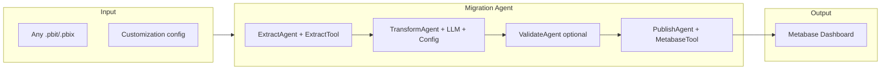

# Generic Power BI to Metabase Migration Utility (Agent-Based) — v2

## Goal

Build a **reusable utility** that can transform **any** Power BI project (.pbit or .pbix) into Metabase dashboards, with **customization** (naming, chart preferences, DB dialect, which pages to migrate, etc.), implemented as a **Java AI agent** using **LangChain4j** or **Spring AI**.

---

## What the Utility Consumes

- **Input**: Any .pbit (or .pbix) file path + a **customization config** (YAML/JSON).
- **Power BI file contents** (inside the file as ZIP):
  - **DataModelSchema** — JSON (UTF-16 LE): tables, columns, calculated columns, **measures** (DAX), relationships, hierarchies.
  - **Report/Layout** — JSON (UTF-16 LE): report pages, visuals, filters.
  - **DataMashup** — binary (Power Query M); source details not easily readable.
  - Custom visuals and static resources (maps, images).
- **Data**: Target data must live in a **database that Metabase connects to** (e.g. Postgres, MySQL). The utility does not ingest data; it generates Metabase questions/dashboards that query that DB.

---

## Customization Config (Schema)

The utility should accept a config that drives agent and tool behavior. Example shape:

- `**targetDialect`**: `postgres` | `mysql` | `bigquery` — SQL dialect for generated queries.
- `**metabase`**: `baseUrl`, `databaseId`, credentials (or env vars).
- `**naming**`: `dashboardNamePrefix`, `cardNamePrefix` — optional prefixes for created assets.
- `**chartOverrides**`: Map Power BI visual type → Metabase display type (e.g. `choropleth` → `bar`).
- `**pagesToInclude**`: List of report page names to migrate, or `"*"` for all.
- `**defaultDisplay**`: Default Metabase chart type when no mapping exists (e.g. `table` or `line`).

This config is passed into the agent scope so the LLM and tools can apply it during transform and publish.

---

## High-Level Agent Architecture

---

## Pipeline Steps (Reference)

The agent implements these steps; the following is reference detail.

### 1. Data pipeline (prerequisite)

- Get data into a DB Metabase can use (e.g. Postgres). The template does not contain data; you need tables that match the Power BI model.

### 2. Extract

- Unzip the .pbit and read **DataModelSchema** and **Report/Layout** as **UTF-16 LE**, then parse as JSON. Use PyPbitExtractor/PyDaxExtract (Python) or Java (unzip + Jackson UTF-16LE). Output: normalized schema (tables, measures, relationships, visuals per page).

### 3. Transform

- Input: extracted schema + config. One structured LLM call to produce a JSON array of Metabase card definitions (name, description, native SQL, display, visualization_settings). Prompt includes config (dialect, chart overrides).

### 4. Load

- Metabase REST API: session, create card, create dashboard, add cards. Implement in Java (HttpClient) or Python.

### 5. Custom visuals

- Map Power BI custom visuals (e.g. choropleth) to the closest Metabase type (map, bar, line) or document for manual refinement.

---

## LangChain4j vs Spring AI

- **LangChain4j**: Built-in agentic module (`@Agent`, workflows, `@Tool`). Best fit for a **sequential workflow** of agents (Extract → Transform → Publish) with tools (`ExtractPbitTool`, `MetabaseApiTool`). Config passed as `AgenticScope` input.
- **Spring AI**: `ChatClient` + function calling; you orchestrate the pipeline in code. Good if you are all-in on Spring Boot.
- **Recommendation**: Prefer **LangChain4j** for a generic transformer agent; use **Spring AI** if you want to avoid adding LangChain4j and implement the pipeline explicitly.

---

## Agent Design (LangChain4j): Tools and Workflow

### Tools

- `**ExtractPbitTool`** (`@Tool`): Input: .pbit/.pbix path. Unzips, reads DataModelSchema and Report/Layout as UTF-16 LE, parses JSON; returns normalized extracted schema (tables, columns, measures/DAX, relationships, visuals per page). Implement in Java (e.g. `java.util.zip`, Jackson UTF-16LE).
- **TransformAgent** (LLM): Input from scope: extracted schema + config. Structured prompt to JSON array of Metabase card definitions (name, description, native SQL, display, visualization_settings). Prompt includes config (dialect, chart overrides, naming).
- `**ValidateSqlTool`** (optional): Input: card definitions; optional dry-run/syntax check against target DB.
- `**MetabaseApiTool`** (`@Tool`): Metabase REST (session, create card, create dashboard, add cards). Uses config for baseUrl, databaseId, credentials.

### Sequential workflow

- **ExtractAgent** → output key `extractedSchema`; **TransformAgent** → `metabaseCards`; **ValidateAgent** (optional); **PublishAgent** → `dashboardId`/`dashboardUrl`. Wire with `AgenticServices.sequenceBuilder()`. Initial input: `pbitPath`, `config`. Customization (dialect, chart overrides, naming, pages, Metabase settings) is applied by the LLM and tools. Alternative: **SupervisorAgent** for adaptive ordering.
- **Spring AI alternative**: Same pipeline (Extract, Transform, Publish) implemented in Java with `ChatClient` and explicit code; config as DTO/bean.

---

## Implementation Order (Generic Utility)

1. **Config model**: Define config DTO/schema (YAML or JSON); load from file or API.
2. **Extract in Java**: .pbit unzip + UTF-16 LE + JSON parse to extracted schema (tables, measures, relationships, visuals). Optional CLI that writes `extracted.json`.
3. **LangChain4j**: Add `langchain4j` + `langchain4j-agentic` + LLM provider; implement `ExtractPbitTool`, `MetabaseApiTool` as `@Tool` classes.
4. **ExtractAgent** calls `ExtractPbitTool`; writes `extractedSchema` to scope.
5. **TransformAgent** reads scope + config; LLM prompt; parse response to Metabase card list; write `metabaseCards` to scope.
6. **PublishAgent** + **MetabaseApiTool**: create session, cards, dashboard, attach cards; write dashboard ID/URL to scope.
7. **Pipeline**: `AgenticServices.sequenceBuilder()` with Extract → Transform → Publish; entry input: `pbitPath`, `config`.
8. **Optional**: ValidateAgent + `ValidateSqlTool`; conditional retry; or Supervisor variant.
9. **CLI or REST**: Expose as e.g. `migrate --pbit path --config config.yaml` for any .pbit and config.

---

## Summary

- **Goal**: Generic Power BI → Metabase transformer with **customization**, implemented as a **Java AI agent** (LangChain4j or Spring AI).
- **Recommendation**: **LangChain4j** (`langchain4j-agentic`) for declarative agents + tools + sequential workflow; **Spring AI** if you prefer Spring-only and explicit Java pipeline.
- **Design**: Extract → Transform (LLM + config) → [Validate] → Publish, with tools for .pbit extraction and Metabase API. Config drives dialect, naming, chart overrides, pages, Metabase connection.
- **Data**: Utility only generates Metabase questions/dashboards; target DB must already contain the data.

